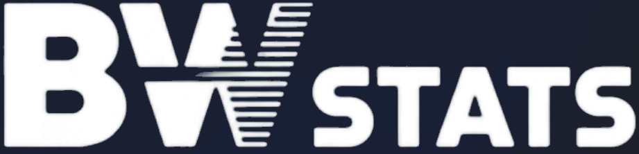

  

<h1 align="center">BWSTATS</h1>

  World of Tanks Statistics & Hangar Tools 
  Lightweight • Fast • Modern UI

---

## 🚀 Overview

BWSTATS is a lightweight World of Tanks mod presentation website focused on:

- Player statistics tracking  
- Progression analysis  
- Hangar utility tools  

This project represents the modern web presence of **BW STATS & Hangar Tools**, redesigned with a clean neon gaming interface and performance-first frontend.

---

## ✨ Features

- 📊 Player statistics overview (WN8, performance tracking)
- 🛠 Hangar tools presentation
- ⚡ Lightweight and fast UI
- 📱 Fully responsive design
- 🎥 Animated hero section with video background
- 🎮 Modern neon gaming style
- 🧩 Clean layout inspired by original BW STATS

---

## 🧱 Tech Stack

- React (Vite)
- Custom CSS (no framework)
- HTML5 Video
- JavaScript (ES6+)

---

## 📦 Installation

Clone the repository:

git clone https://github.com/YOUR-USERNAME/bwstats-website.git
cd bwstats-website

Install dependencies:

npm install

Run development server:

npm run dev

Open in browser:

http://localhost:5173

---

## 📁 Project Structure

bwstats-website/
├── src/
│   ├── assets/        # images, video, logo
│   ├── components/    # reusable components
│   ├── App.jsx
│   ├── styles.css
│   └── main.jsx
├── public/
├── index.html
├── package.json
└── README.md

---

## 🌐 Live Website

https://www.bwstats.org

(Deployment via Vercel or Netlify recommended)

---

## 📥 Downloads

The platform provides access to:

- BW STATS mod  
- Hangar Tools  

---

## 🎯 Project Goal

- Modernize the original BW STATS experience  
- Provide a clean and professional landing page  
- Centralize mod downloads and updates  
- Deliver a premium “game launcher” style UI  

---

## ⚠️ Disclaimer

This project is a fan-made tool and is not affiliated with Wargaming.net.

World of Tanks is a trademark of Wargaming.net.

---

## 👤 Author

BWSTATS Project  
https://www.bwstats.org
